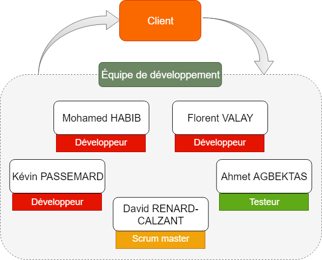

# Cthulhu-Agility
## Service de génération de code barres

**Membres du projet**

| AGBEKTAS Ahmet | HABIB Mohamed | RENARD-CALZANT David | PASSEMARD Kevin | VALAY Florent |
|:-:|:-:|:-:|:-:|:-:|

---

# Sommaire

Dans le cadre de la réalisation de ce projet, notre équipe de développement va mettre en œuvre une solution de génération de code barres. Ce projet a pour but d'intégrer à des sites web existants une interface légère de gestion de code barres. Cette dernière permettra à l'utilisateur de rentrer des chiffres correspondants à l'étiquette d'un produit et de générer ensuite un code barres valide, qui pourra être exporté au format pdf ou imprimer.

Après identification des besoins du client, il en ressort différentes fonctionnalités qui devront être intégrées à notre solution :
* un script léger que l'utilisateur pourra placer où il le souhaite sur son site web.
* l'exportation en pdf de l'image du code barres
* l'impression de l'image du code barres

À l'issue de ce projet, le client pourra optimiser sa productivité en gagnant du temps lors de l'étiquettage des produits. Le service que nous développons ayant une envergure assez restreinte, notre petite équipe de développement est adaptée pour répondre à ce problème, que ce soit en terme de coût ou d'efficacité.

La solution que nous avons retenu pour la mise en œuvre de ce projet consiste à développer un script en JS intégrable via une balise **\<iframe>**. L'ergonomie et la facilité d'intégration sont des avantages qui nous ont poussé à choisir cette solution plutôt qu'une autre. Dans un cas d'utilisation nominal, l'utilisateur clique sur l'élément concerné sur le site web du client, ce qui lance la fenêtre de génération de code barres. Après avoir saisi les chiffres composants le code barres, le système génère une image que l'on peut imprimer, télécharger en pdf ou bien copier dans le presse-papier.

Afin d'évaluer la réussite du projet, nous procéderons à plusieurs enquêtes de satisfaction cliente à chaque démonstration. Les critères principaux sont l'ergonomie, la facilité d'intégration au site web et l'assurance que les codes barress générés sont valides. Pour ce dernier point, notre équipe de développement utilise la méthode **TDD** pour vérifier au maximum le bon fonctionnement du système et satisfaire les exigences du client.

---

# Gestion de l'intégration

## 1.Gouvernance du projet et structure de l'équipe du projet

Dans le cadre de l'organisation de ce projet, il est important de définir les moyens de communications entre les différents acteurs prenant part à la conception. Tout d'abord, le client est l'émetteur des besoins et l'utilisateur final de la solution développée, sa participation est essentielle afin que l'équipe de développement est une bonne compréhension du problème. La méthode Scrum étant un pilier fondamental pour le bon déroulement du projet, le client assiste à une démonstration du logiciel à l'issue de chaque sprint. C'est à cette occasion que l'on s'assure que la solution réponde bien à ses exigences, mais aussi que de nouveaux besoins peuvent apparaître.

Pour la communication interne au sein de l'équipe de développement, ce point sera détaillée dans la partie **"Gestion de la communication"**

__Organismes de gouvernance__

## 2.Rôles et responsabilités

* Product Owner : Il est client et émetteur des besoins, il définit avec l'équipe de développement les fonctionnalités attendues pour le produit.
* Scrum master : Son rôle est d'assurer la cohésion et l'organisation de l'équipe de développement en répartissant les tâches suivants les besoins actuels.
* Testeur : La mission du testeur est d'élaborer des scénarios de tests pour que la solution développée soit conforme aux attentes du client et fonctionne correctement.
* Développeur : Discuter avec le client des fonctionnalités attendues, développer une solution adéquate et s'occuper des aspects techniques du projet comme la production, l'intégration et la maintenance sont les objectifs du développeur.

## 3.Gestion du changement

## 4.Clôture du projet 

---

# Gestion de la portée

Tout au long du projet, des réunions régulières avec les membres de l'équipe de développement vont nous permettre de définir les axes à travailler à chaque séance. Ce processus assure une gestion constante du contenu produit et de son adéquation avec les besoins du projet.

Par ailleurs, il est important de noter les différentes fonctionnalités attendues par le client et lister de manière non-exhaustive celles qui n'en font pas partie.

**Activités visées par le projet**
* Génération de code barres sous forme d'image à partir d'un code à 13 chiffres
* Exportation au format PDF
* Impression de l'image du code barres
*Activités visées en cas de temps supplémentaire* 
* Génération de code barres sous forme d'image à partir d'un code à 15/18 chiffres

**Activités non-visées par le projet**
* Génération de QR Code

Pour recenser les exigences du client, des démonstrations sont organisées à l'issue de chaque séance pour s'assurer que les fonctionnalités développées correspondent bien aux attentes du client. Cela nous permet également de définir un "cap" pour la séance suivante et définir ensemble les points à travailler.

Au cours de la phase de développement, de nouveaux besoins peuvent émerger et il est important d'en mesurer la faisabilité. À cet effet, chaque nouvelle fonctionnalité fait l'objet d'une étude par l'équipe de développement pour décider ou non de son intégration ainsi que du coût engendré, de la répartition des effectifs pour la réaliser ...

**Contraintes**
Au vue des délais assez courts pour la réalisation de ce projet, il nous est difficile de développer des fonctionnalités très avancées, c'est pour cela que nous avons choisi un découpage en activités simples, facilement réalisables et intégrables.

---

# Gestion du calendrier

Le projet se déroulera du **2 mars** au **2 avril**, les différents jalons s'étalent sur cette période et sont définis suivant le tableau suivant :

| **Modules** | 02/03 | 12/03 | 26/03 | 02/04 |
|:-:|:-:|:-:|:-:|:-:|
| Tests | :x: | :white_check_mark: | :white_check_mark: | :x: |
| *Développements applicatifs* |  |  |  |  |
| 1. Processing | :x: | :white_check_mark: | :white_check_mark: | :x: |
| 2. Moteur de rendu | :x: | :x: | :white_check_mark: | :white_check_mark: |
| Interfaçage | :x: | :white_check_mark: | :x: | :x: |
| Front-end | :x: | :white_check_mark: | :white_check_mark: | :white_check_mark: |
 
Pour vérifier le bon déroulement de chaque tâche, nous utilisons l'outil de **[Planification de projet](https://projets.univ-avignon.fr/)** de l'université d'Avignon. Grâce à cet outil, nous pouvons définir des tâches, les attribuer facilement aux membres de l'équipe, fixer des échéances. Cette solution offre également différentes vues (tableau de bord, liste de tâches, diagramme de Gantt) nous permettant d'avoir une vision globale de l'avancement du projet.

---

# Gestion des coûts

Durant la réalisation du projet, trois phases permettront d'évaluer les coûts inhérents au développement des fonctionnalités : la phase initiale, la phase d'ajustement et la réévaluation finale.

Après avoir rencontré le client et établit ses besoins vis-à-vis de l'application à développer, il est possible d'établir une estimation du coût global de l'application. Cette étape correspond à la phase initiale et se déroule donc au lancement du projet.

À l'inverse, plusieurs phases d'ajustement ont lieu à l'issue de chaque daily et rencontre avec le client. En cas d'ajout de fonctionnalités ou de modifications de celles déjà présentes, on dresse un nouveau tableau d'estimation des coûts.

Pour finir, à l'issue de la phase de réalisation du projet, une dernière étape de vérification aura lieu pour valider les estimations précédentes et s'assurer du non-dépassement des coûts prévus initialement.

**Estimation**

À l'issue d'une discussion au sein de l'équipe de développement au lancement du projet, il a été décidé du volume horaire nominal pour la réalisation de ce projet. Le temps alloué à la phase de spécification, de développement et d'intégration représente un total de 15h de travail pour chaque membre de l'équipe, réparti sur 2 séances de 4h30 et 2 séances de 3h. C'est une estimation du temps total nécessaire à la réalisation de ce projet, sachant que tout délai supplémentaire ne sera pas facturé au client.

|**Intitulés**|**Montants (en €)**|
|:--|:-:|
|Charges locatives | 300 |
|Charges salariales ||
|Salaires développeur | 706.95 |
|Salaire testeur | 182.10 |
|Salaire scrum master | 345.90 |
|||
|**Total**| **1534.95** |

Les charges locatives correspondent au loyer du bâtiment utilisé par l'équipe de développement durant la réalisation du projet.

Les charges salariales se divisent de manière suivante :
* Salaire horaire brut (Dev): 15.71€
* Salaire horaire brut (Scrum Master): 23.06€
* Salaire horaire brut (Testeur) : 12.14€

**Contrôle du budget**

Pour s'assurer du contrôle du budget, chaque rétrospective sera l'occasion de vérifier la qualité du code produit au cours de la séance et sa cohérence avec les estimations réalisées. Le nombre d'heures nécessaires à la réalisation d'une étape sera comparée au temps estimé afin de piloter plus facilement les futures étapes du projet et adapter les tâches en cours.

---

# Gestion de la qualité

Au cours de ce projet, diverses procédures ont été mises en place pour assurer la qualité du logiciel produit :
* Des démonstrations régulières avec le client ont permit de s'assurer de la bonne réalisation des besoins exprimés au début du projet
* À chaque fin de séance, une rétrospective a lieu pour vérifier la qualité de chaque fonctionnalité développée
* Le testeur a réalisé une batterie de tests tout au long du projet pour couvrir chacun des besoins

---

# Gestion des communications

Nous commençons nos séances par un daily, dans lequel nous détaillons chaque activité que nous avons faite pendant la séance précédente. Nous fixons les objectifs à réaliser pour la séance en cours.

Le scrum master affecte une tâche spécifique pour chaque membre de l'équipe. Si la tâche en question demande plus de personnes, on peut être amenés à travailler à plusieurs sur la même tâche on découpant en plusieurs sous-tâches.

Quand on est confronté à des situations où nous avons une incompréhension du sujet ou d'une tâche, pour minimiser les erreurs au maximum, nous demandons au client ce qu'il en pense, et nous lui demandons plus d'explications.

Le fait d'avoir le retour du client très rapidement est très bénéfique pour notre équipe Développement.

À la fin de chaque séance nous faisont une retrospective, pendant la quelle chaque personne de l'équipe indique là où il en est de la tâche qui lui à été assignée.

* Les outils que nous avons mis en place pour mener à bien le projet :
  - Nous avons mis en place un dépot GitHub pour pouvoir déposer nos codes pour le développement et les éventuelles tests.
  - Nous avons mis en place un serveur Discord pour pouvoir s'échanger des messages, et s'envoyer les articles dont on juge utiles.
  - Nous avons mis en place un outil de planification de projet qui contient les diagrammes de Gantt, les tâches que chacun doit réaliser et bien d'autres fonctionnalités utiles.

Nous utilisons les méthodes agiles, pour cela nous organisons régulièrement des réunions avec le client pour savoir si ça correspond bien au cahier des charges.

## Analyse des intervenants

| Nom de l'intervenant | Impact de l'intervenant sur le projet | Impact du projet sur l'intervenant | Exigences en matière de communications |
|:-|:-|:-|:-|

## Rapports sur le projet et communications

## Collecte de données
